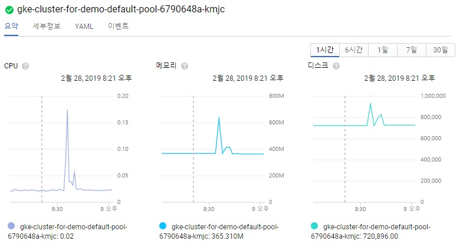
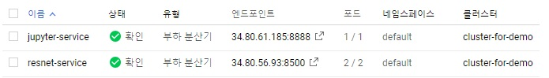
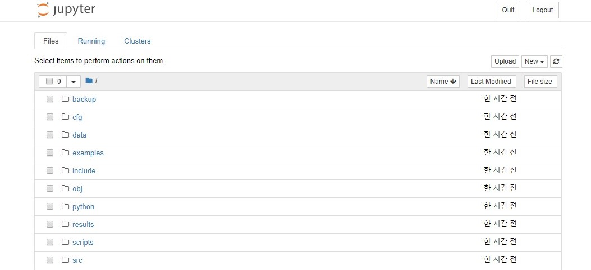

## GCP-Kubernetes-darknet
we use  Google Cloud Platform(GCP)'s Cluster computing resource and kubernetes engine for running YOLOv3-tiny model

# First, Cluster setting
Google Cloud Platform Guide for cluster computing : https://cloud.google.com/kubernetes-engine/docs/quickstart?hl=en

we only create one cluster then, can start Google kubernetes engine for Cluster.
(cluster can be made within GUI or gcloud cmd)

In kubernetes engine menu, top right direction we can see google cloud shell icon. In this cloud cluster shell, we manage our kubernetes's 
componnents.

# Second, Docker custom image setting
we creates new custom image for Jupyter Notebook and darknet part for YOLOv3-tiny.

this Custom image is based in https://github.com/jupyter/docker-stack/base-notebook

and below lines is attached in dockerfile for darknet YOLO
```
RUN apt-get build-essential \
git\
camke\
wget\
.
.
.
RUN git clone https://github.com/pjreddie/darknet
RUN fix-permissions $HOME/darknet
WORKDIR $HOME/darknet
RUN make
RUN wget https://pjreddie.com/media/files/yolov3-tiny.weights
```
and then, docker image build cmd input.

```
$docker build -t [username]/[image name] [Dockerfile path]
```

# Third, Kubernetes image registry and create new deployment
change the tag
```
$docker tag [username]/[image name] gcr.io/[google cloud project name]/[image name]
$docker images
```
```gcr.io``` is [COMPUTE_ZONE] parameter in cluster ex) us-west1-a
then, you can see the new image in docker

```
REPOSITORY                                      TAG                 IMAGE ID            CREATED             SIZE
[username]/[image name]                         latest              5cd817ad4cc1        7 minutes ago       1.11GB
gcr.io/[google cloud project name]/[image name]   latest            5cd817ad4cc1        7 minutes ago       1.11GB
```

registry your custom image using cmd

```
$gcloud docker -- push [custom image name]
```

```[custom image name]``` is like ```gcr.io/kubernetes-23919/jupyter```.
then, your custom image is uploaded in Google's project DockerHub.

now, you can create new components in cluster like pods, deployments with service(it's help you to externel access into cluster.
I make new yaml file(./docker_jupyter.yaml). this has two components as deployment and service.
if you need new .yaml file then, reference offcial page(https://kubernetes.io)
```
$kubectl create -f demo_jupyter.yaml
```
then, you can see new components in google cluster platform

# result picture



Use yaml file in project, can using Jupyter and Darknet in conda with linux environment.



Darknet can execute in Jupyter terminal
```
./darknet detect cfg/yolov3-tiny.cfg yolov3-tiny.weights [object picture]
```


## Extra, How kubernetes set in the raspberry pi
Another project is about docker ML model in Raspberry pi. Now we set kuberenetes in raspberry pi.

One, Apply subnet for kubernetes cluster

we can use the flannel in opensource.
```
$ kubectl apply -f https://raw.githubusercontent.com/coreos/flannel/a70459be0084506e4ec919aa1c114638878db11b/Documentation/kube-flannel.yml
```
then, automatically set the cluster IP and subnet

Two, master node initialize
```
$ kubeadm init --pod-network-cidr 10.244.0.0/16 --ignore-preflight-errors --apiserver-advertise-address=[YOUR IP ADDRESS]
```
```10.244.0.0/16``` is Cluster IP set to flannel.
```--ignore=preflight-errors``` is the option about H/W spec for Kubernetes. but, Raspberry PI can not apply this part so, just ignore.
After initialize, you can see token about join command.

Third, worker node setting
```
$ kubeadm join [master-ip]:[master-port] --token [token] --discovery-token-ca-cert-hash sha256:[hash]
```
This command input in worker nodes. after this, master nodes can show these(worker nodes) with below command.
```
$ kubectl get nodes
```
